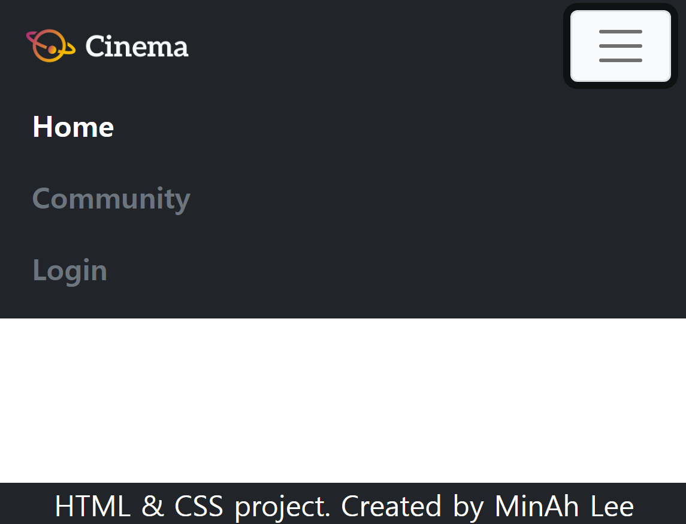
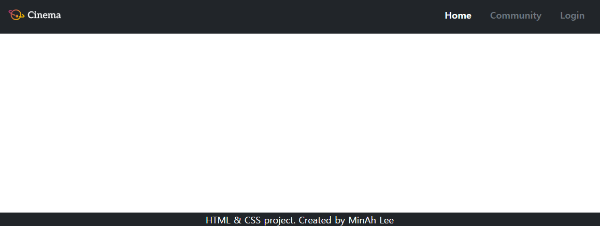
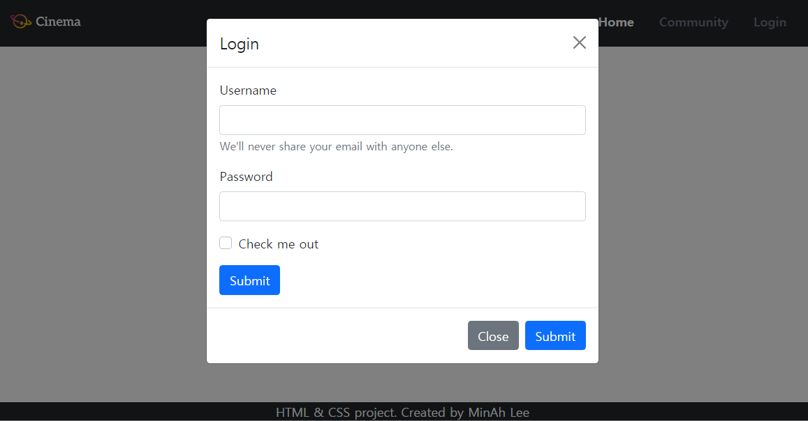
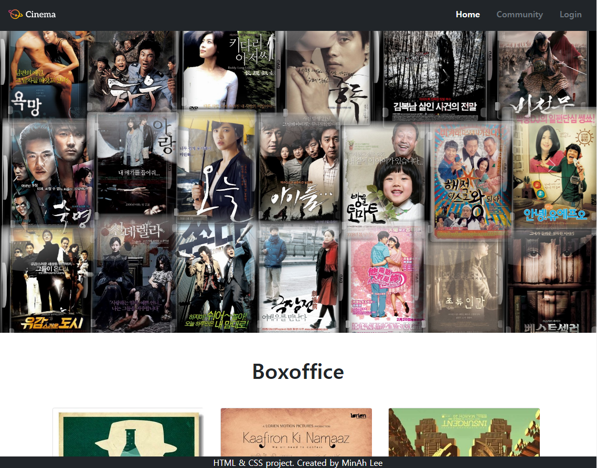
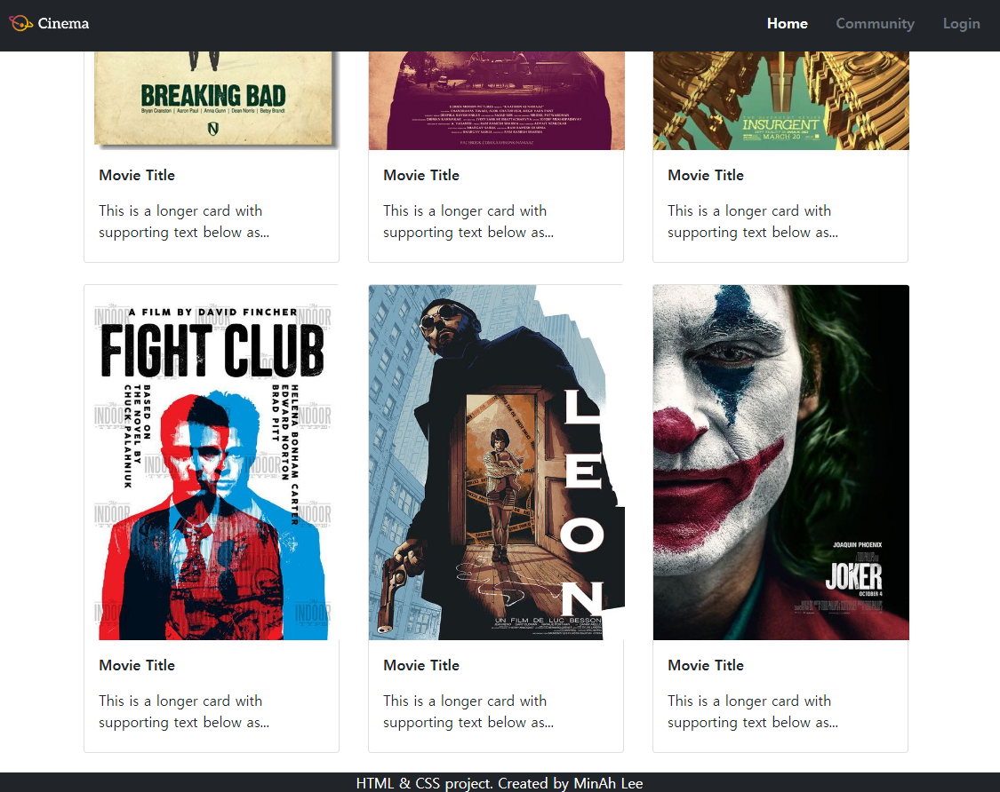
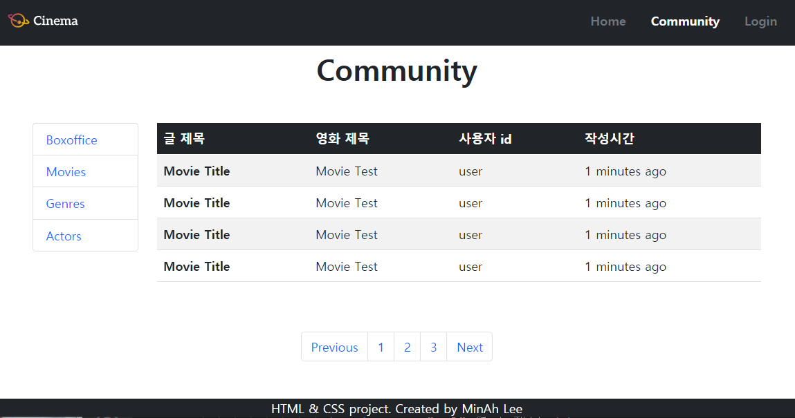
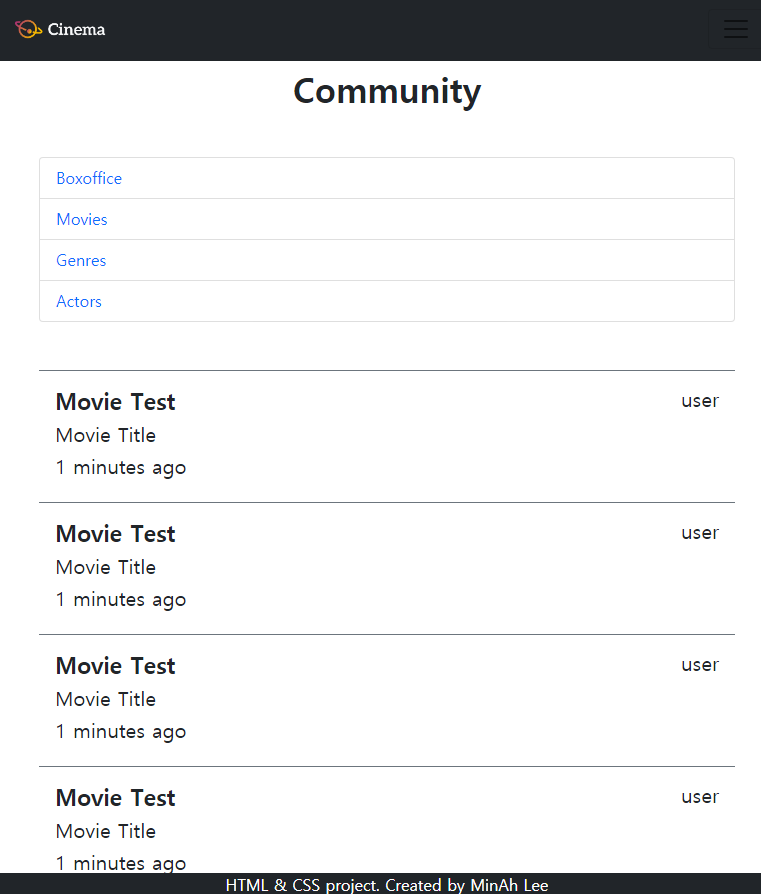

# Project_HTML_Movie

### 서울 3반 이민아 21.02.05


>  HTML, CSS, Boostrap


> 목차

- [Image](#image)

- [CDN](#cdn)

- [nav_footer.html](#nav_footerhtml)

- [home.html](#homehtml)

- [community.html](#communityhtml)
- [후기](#후기)


---

### Image

#### (1) nav_footer.html

> Navbar, Modal, Footer








#### (2) home.html

> Movie Carousel, Movie Card



###  


#### (3) community.html

> Review (SideBar, Board), Pagination







---

### CDN

> `<head>`와 `<body>`에 link와 script 첨부

```python
<!DOCTYPE html>
<html lang="ko">
<head>
  <meta charset="UTF-8">
  <meta name="viewport" content="width=device-width, initial-scale=1.0">
  <link rel="stylesheet" href="01_nav_footer.css">
  <link href="https://cdn.jsdelivr.net/npm/bootstrap@5.0.0-beta1/dist/css/bootstrap.min.css" rel="stylesheet" integrity="sha384-giJF6kkoqNQ00vy+HMDP7azOuL0xtbfIcaT9wjKHr8RbDVddVHyTfAAsrekwKmP1" crossorigin="anonymous">
  <title>Navbar Footer Test</title>
</head>
<body>
  <script src="https://cdn.jsdelivr.net/npm/bootstrap@5.0.0-beta1/dist/js/bootstrap.bundle.min.js" integrity="sha384-ygbV9kiqUc6oa4msXn9868pTtWMgiQaeYH7/t7LECLbyPA2x65Kgf80OJFdroafW" crossorigin="anonymous"></script>
</body>
</html>
```


---

###  nav_footer.html


### 1.  Navbar

#### (1) nav 태그 (navbar)

> 항상 상단에 고정 (`fixed-top`)
>
> 배경색 (`bg-dark`)

```python
<nav class="fixed-top bg-dark navbar navbar-expand-lg navbar-light bg-light">
</nav>
```

#### (2) div 태그 (container-fluid)

> 이미지와 리스트 양쪽 끝에 배치 (`d-flex justify-content-between`)
>
> 수직 중앙 배치 (`align-items-center`)

```python
<div class="d-flex justify-content-between align-items-center container-fluid">
</div>
```

#### (3) a 태그 (navbar-brand) / img 태그

> images 폴더 안의 logo.png파일 (img 태그)
>
> 이미지 크기 (`style="width: 100px;"`)
>
> 클릭이 가능한 링크 (a태그)
>
> 해당 페이지(02_home.html)로 이동 (`href="02_home.html"`)

```python
<a class="navbar-brand" href="02_home.html">
  
</a>
```

#### (4) button 태그 (navbar-toggler)

> 가로 크기가 768px 미만일 경우(md)에는 햄버거 버튼으로 교체 (`navbar-toggler`)
>
> 클릭했을 시 세부 항목(`data-bs-toggle="collapse"`)
>
> **id값 동일** 확인 (`data-bs-target="#navbarSupportedContent"`)

```python
<button class="navbar-toggler btn-light" type="button" data-bs-toggle="collapse" data-bs-target="#navbarSupportedContent" aria-controls="navbarSupportedContent" aria-expanded="false" aria-label="Toggle navigation">
  <span class="navbar-toggler-icon"></span>
</button>
```

#### (5) div 태그 (collapse)

> 네비게이션 리스트(Home,Community, Login)가 보일 때에는 오른쪽 정렬(`justify-content-end`)
>
> 버튼일 때에는 리스트가 왼쪽 정렬(**d-flex가 들어가지 않으면** 버튼 누를 때에는 기본 왼쪽 정렬)
>
> **id값** **동일** 확인 (`id="navbarSupportedContent"`)

```python
<div class="justify-content-end collapse navbar-collapse" id="navbarSupportedContent">
</div>
```

#### (6) ul 태그 (navbar-nav) / li 태그 (nav-item) / a 태그 (nav-link)

> 리스트(Home, Community, Login) (ul 태그/li 태그)
>
> 클릭이 가능한 링크 (a태그)
>
> 해당 페이지(02_home.html, 03_community.html, #)로 이동 (`href="02_home.html"`)
>
> Home을 강조 (`active`)
>
> 양쪽 가로 여백 (`mx-2`)
>
> 글씨 색 굵기 (`text-white` `text-secondary` `fw-bold`)
>
> modal로 연결 (`data-bs-toggle="modal"`)
>
> **id값 동일** 확인 (`data-bs-target="#exampleModal"`)

```python
<ul class="navbar-nav">
  <li class="nav-item">
    <a class="nav-link active mx-2 text-white fw-bold" aria-current="page" href="02_home.html">Home</a>
  </li>

  <li class="nav-item">
    <a class="nav-link mx-2 text-secondary fw-bold" href="03_community.html">Community</a>
  </li>

  <li class="nav-item">
    <a class="nav-link mx-2 text-secondary fw-bold" href="#" data-bs-toggle="modal" data-bs-target="#exampleModal">Login</a>
  </li>

</ul>
```


### 2. Modal

#### (1) div 태그 (modal fade) 

> **nav 태그와 별도**로 적어야 한다
>
> **id값 동일** 확인 (`id="exampleModal"`)

```python
<div class="modal fade" id="exampleModal" tabindex="-1" aria-labelledby="exampleModalLabel" aria-hidden="true">
  <div class="modal-dialog">
    
    <div class="modal-content">
    
      <div class="modal-header">
        <h5 class="modal-title" id="exampleModalLabel">Login</h5>
        <button type="button" class="btn-close" data-bs-dismiss="modal" aria-label="Close"></button>
      </div>
    
      <div class="modal-body">
        <form>
        </form>
      </div>
    
      <div class="modal-footer">
        <button type="button" class="btn btn-secondary" data-bs-dismiss="modal">Close</button>
        <button type="button" class="btn btn-primary">Submit</button>
      </div>
    
    </div>
    
  </div>
</div>
```

#### (2) form 태그 / div 태그 / label 태그 / input 태그

> Modal 컴포넌트 내부에는 form 요소를 배치 (form)
>
> **id값 동일** 확인 ( `for="exampleInputEmail1"`과 `id="exampleInputEmail1"` )

```python
<form>
 <div class="mb-3">
   <label for="exampleInputEmail1" class="form-label">Username</label>
   <input type="email" class="form-control" id="exampleInputEmail1" aria-describedby="emailHelp">
   <div id="emailHelp" class="form-text">We'll never share your email with anyone else.</div>
 </div>
    
 <div class="mb-3">
   <label for="exampleInputPassword1" class="form-label">Password</label>
   <input type="password" class="form-control" id="exampleInputPassword1">
 </div>

 <div class="mb-3 form-check">
   <input type="checkbox" class="form-check-input" id="exampleCheck1">
   <label class="form-check-label" for="exampleCheck1">Check me out</label>
 </div>
 <button type="submit" class="btn btn-primary">Submit</button>
</form>
```


### 3.  Footer 

#### (1) footer 태그

> 항상 하단에 고정(`fixed-bottom`)
>
> 배경색 (`bg-dark`)
>
> 여백 동일 수직, 수평 중앙에 배치(`d-flex justify-content-center` `align-items-center`) 

```python
<footer class="fixed-bottom bg-dark d-flex justify-content-center align-items-center">
</footer>
```

#### (2) p태그

> 내용의 빈 부분(`_____`)은 본인의 이름
>
> 개발자도구로 보면 가운데 정렬을 위해 margin bottom 1rem 제거 (`mb-0`)
>
> 글자 색 (`text-white`)

```python
<p class="text-white mb-0">HTML & CSS project. Created by MinAh Lee</p>
```


---

### home.html

### 1. Movie Carousel

#### (1) header 태그

```python
<header>
  <div>
  </div>
</header>
```

#### (2) div 태그 (carousel slide)

> carousel (`data-bs-ride="carousel"`)
>
> **id 값 동일** 확인 (`id="carouselExampleIndicators"`)

```python
<div id="carouselExampleIndicators" class="carousel slide" data-bs-ride="carousel">

</div>
```

#### (3) ol 태그 (carousel-indicators) / li 태그 

> 첫번째 페이지 활성화 (`active`)
>
> **id 값 동일** 확인 (`data-bs-target="#carouselExampleIndicators"`)

```python
<ol class="carousel-indicators">
  <li data-bs-target="#carouselExampleIndicators" data-bs-slide-to="0" class="active"></li>
  <li data-bs-target="#carouselExampleIndicators" data-bs-slide-to="1"></li>
  <li data-bs-target="#carouselExampleIndicators" data-bs-slide-to="2"></li>
</ol>
```

#### (4) div 태그 (carousel-inner) / div 태그 (carousel-item) / img 태그

> **자동**으로 전환 (`data-bs-interval="1000"`)
>
> 상대 경로 이미지 삽입 (img 태그)
>
> 사진 부모 요소 상대 비율 100% (`w-100`)
>
> 첫번째 페이지 활성화 (`active`)

```python
<div class="carousel-inner">

  <div class="carousel-item active" data-bs-interval="1000">
	
  </div>

  <div class="carousel-item" data-bs-interval="1000">
	
  </div>

  <div class="carousel-item" data-bs-interval="1000">
	
  </div>

</div>
```

#### (5) a 태그 (carousel-control-prev / carousel-control-next)

> **id 값 동일** 확인 (`href="#carouselExampleIndicators"`)

```python
<a class="carousel-control-prev" href="#carouselExampleIndicators" role="button" data-bs-slide="prev">
  <span class="carousel-control-prev-icon" aria-hidden="true"></span>
  <span class="visually-hidden">Previous</span>
</a>

<a class="carousel-control-next" href="#carouselExampleIndicators" role="button" data-bs-slide="next">
  <span class="carousel-control-next-icon" aria-hidden="true"></span>
  <span class="visually-hidden">Next</span>
</a>
```


### 2.  Title

> 글자 크기 굵기 (`fw-bold` `display-1`)
>
> 글자 가운데 정렬 (`text-center`)
>

```python
<h1 class="text-center fw-bold display-1 my-5">Boxoffice</h1>
```


### 3. Movie Card

#### (1) section 태그 (container)

> grid (`container`)
>
> 위아래 세로 여백 (`my-5`)

```python
<section class="container my-5">
</section>
```

#### (2) div 태그 (row)

> grid (`row`)
>
> 좌우 일정한 간격(`g-4`)
>
> 가로 크기가 576px미만(sm)일 경우에는 한 열(row)에 1개씩(`row row-cols-1`)
>
> 가로 크기가 576px이상일 경우에는 한 열(row)에 2개 이상 자유롭게 표시 (`row-cols-sm-2` `row-cols-md-3`)

```python
<div class="row row-cols-1 row-cols-sm-2 row-cols-md-3 g-4">
</div>
```

#### (3) article 태그 / div 태그 (card) / img  태그 / p 태그

> 상대경로 이미지(img 태그), 제목, 설명(p 태그)을 포함 
>
> div 태그 카드 사이즈 너비 높이(`style="width: 18rem; height: 33rem;"`)
>
> p 태그 제목 설명 글자 굵기(`fw-bold`)
>
> img 태그 이미지 사이즈 너비 높이(`style="width: 18rem; height: 25rem;"`)
>

```python
<article>
  <div class="card" style="width: 18rem; height: 33rem;">
    
    <div class="card-body">
      <p class="card-text fw-bold">Movie Title</p>
      <p class="card-text">This is a longer card with supporting text below as...</p>
     </div>
  </div>
</article>
```


---

### community.html


### 1. Review

#### (1) div 태그 (container)

> grid (`container`)

```python
<div class="container main">
</div>
```

#### (2) h1 태그 

> 글자 크기 굵기 (`fw-bold` `display-1`)
>
> 글자 가운데 정렬 (`text-center`) 
>
> 위아래 세로 여백 (`my-5`)

```python
<h1 class="text-center fw-bold display-1 my-5">Community</h1>
```

#### (3) div 태그 (row)

> 992px 이상일 경우 좌측 Sidebar 1/6 만큼(`col-lg-2`)의 너비
>
> 992px 이상일 경우 좌측 Board **표(table)요소**로 5/6 만큼(`col-lg-10`)의 너비
>
> 992px 미만일 경우에는 Sidebar div.main영역의 내부에서 전체(`col-12`)
>
> 992px 미만일 경우에는 Board **글(article)요소**들의 집합 내부에서 전체(`col-lg-12`)

```python
<h1 class="text-center fw-bold display-1 my-5">Community</h1>

<div class="row">
  <aside class="col-12 col-lg-2">
  </aside>
    
  <section class="col-12 col-lg-10">
  </section>
</div>
```


### 1.1 SideBar (aside 태그 (col-12 col-lg-2) )

#### (1) ul 태그 (list-group) / li 태그 (list-group-item) / a 태그 (text-decoration-none)

> 각 항목들(Boxoffice, Movies, Genres, Actors) (ul태그 / li 태그)
>
> 항목들은 클릭이 가능한 링크 (a태그)
>
> a 태그 밑줄 제거 (`text-decoration-none`)
>
> li 태그 글자 색 (`text-primary)`

```python
<aside class="col-12 col-lg-2">
  <ul class="list-group">
	<li class="list-group-item text-primary">
	  <a href="#" class="text-decoration-none">Boxoffice</a>
	</li>
  </ul>
</aside>
```


### 1.2 Board (section 태그 (col-12 col-lg-10))

#### (1) div 태그

> Board **표(table)요소** (table) 사이즈 커지면 등장 (`d-none d-lg-table`)
>
> 표 너비 부모 요소 상대 비율 100% (`w-100`)
>
> Board **글(article)요소 **(article) 사이즈 커지면 소멸 (`d-lg-none`)
>
> 위아래 세로 공백 (`my-5`)

```python
<div class="d-none d-lg-table w-100">
  <table class="table table-striped table-hover">
    <thead class="table-dark">
    </thead>
    <tbody>
    </tbody>
  </table>
</div>

<div class="d-lg-none my-5">
  <article>
  </article>
</div>
```

#### (2) table 태그 

> 색 줄무늬 배치 표 (`table-striped`) 
>
> 선 없는 표 (`table-hover`)
>
> 표의 head 색 (`table-dark`)
>
> 제목 분류 기준 (`scope="col"`)
>
> 각 첫 칸에 삽입 (`scope="row"`)

```python
<table class="table table-striped table-hover">

  <thead class="table-dark">
	<tr>
	  <th scope="col">글 제목</th>
	  <th scope="col">영화 제목</th>
	  <th scope="col">사용자 id</th>
	  <th scope="col">작성시간</th>
    </tr>
  </thead>

  <tbody>
	<tr>
	  <th scope="row">Movie Title</th>
	  <td>Movie Test</td>
	  <td>user</td>
	  <td>1 minutes ago</td>
	</tr>
  </tbody>

</table>
```

#### (3) article 태그

> 상자와 contents 사이 여백 padding (`p-3`)
>
> 경계선 위쪽 색 (`border-top` `border-secondary`)
>
> 글 제목인 Movie Test과 사용자 id user를 나란히 양쪽에 배치 (`d-flex flex-row justify-content-between`)
>
> 글자 굵기 (`fw-bold`)

```python
<article>
  <div class="p-3 border-top border-secondary">
	<div class="d-flex flex-row justify-content-between">
      <h4 class="fw-bold">Movie Test</h4>
      <h5>user</h5>
    </div>
    <h5>Movie Title</h5>
    <h5>1 minutes ago</h5>
 </div>
</article>
```


### 2. Pagination

#### (1) nav 태그

```python
<nav aria-label="Page navigation example">
</nav>
```

#### (2) ul 태그 (pagination) / li 태그 (page-item) / a 태그 (page-link)

> 자신의 영역 안에서 좌우 중앙 정렬 (d-flex justify-content-center)
>
> 내부의 요소들은 클릭이 가능한 링크 (a)
>
> 위아래 공백 (my-5)

```python
<ul class="pagination d-flex justify-content-center my-5">
  <li class="page-item"><a class="page-link" href="#">Previous</a></li>
  <li class="page-item"><a class="page-link" href="#">1</a></li>
  <li class="page-item"><a class="page-link" href="#">2</a></li>
  <li class="page-item"><a class="page-link" href="#">3</a></li>
  <li class="page-item"><a class="page-link" href="#">Next</a></li>
</ul>
```


### 6. 후기 

> 기존의 파이썬 코드를 실행할 때에는 오류가 프로그램에서 감지되거나 자동완성 기능이 있어 편리했다. 하지만 html과 동시에 css 그리고 bootstrap을 동시에 접하면서 혼선도 있었고 파이썬의 편리한 기능이 사라져 어려운 점도 있었다. 하지만 파이썬의 경우 가시적인 효과의 결과물보다 터미널에 출력된 간단한 값만 확인할 수 있어서 아쉬웠던 점을 웹 언어를 배우면서 극복할 수 있었다. 비록 오타와 같은 문법적 오류를 직접 찾아내야 하는 단점도 있지만 코드가 적용된 결과를 Chrome을 통해 가시적으로 볼 수 있다는 점이 좋았다. 

